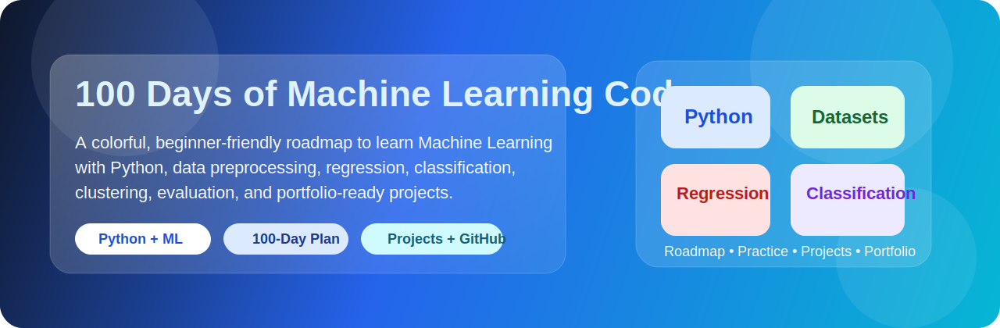
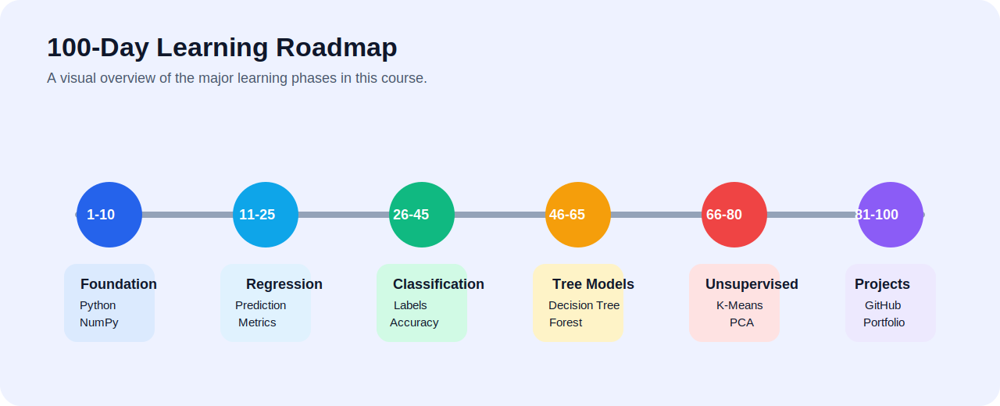
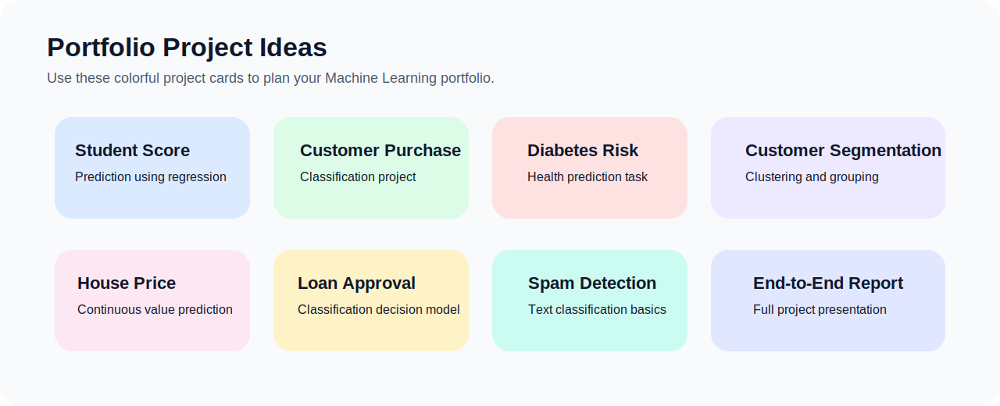

<p align="center">
  
</p>

<h1 align="center">100 Days of Machine Learning Code</h1>

<p align="center">
  <b>A colorful, professional, beginner-friendly Machine Learning course roadmap for students, self-learners, and beginner developers.</b>
</p>

<p align="center">
  
  
  
  
</p>

<p align="center">
  <a href="https://muhammadjunaidniazi.github.io/awesome/">🌐 Live Course Website</a> •
  <a href="https://github.com/muhammadjunaidniazi/awesome">📘 Repository</a> •
  <a href="https://github.com/muhammadjunaidniazi">👨‍💻 GitHub Profile</a>
</p>

---

## 📌 Course Overview

**100 Days of Machine Learning Code** is a structured learning repository designed to help beginners learn Machine Learning step by step. It is inspired by the idea of consistent daily coding practice, but it is written as a clean course-style roadmap with explanations, phases, tools, projects, and portfolio guidance.

This repository is not only a list of algorithms. It explains what to study, why each topic matters, how to practice it, and how to present your learning professionally on GitHub. The goal is to help students move from basic Python knowledge to practical Machine Learning project development.

By following this roadmap, learners will understand the complete Machine Learning workflow: loading data, cleaning datasets, preparing features, training models, evaluating performance, comparing algorithms, improving results, and documenting projects in a professional way.

---

## 🌐 Live Course Website

**Live Website:** https://muhammadjunaidniazi.github.io/awesome/

Use the live website as a clean visual version of this course roadmap. The GitHub README contains the detailed written guide, while the website gives a modern overview for quick reading and sharing.

---

## 🎯 Course Objective

The main objective of this course repository is to provide a clear and practical roadmap for learning Machine Learning from basic concepts to real-world project development. Many beginners start Machine Learning but feel confused because they do not know which topic to learn first, which tools to use, how to practice, and how to build projects.

This repository solves that problem by giving a phase-by-phase learning structure. Each phase focuses on a specific skill area, such as Python fundamentals, data preprocessing, regression, classification, tree-based models, unsupervised learning, and portfolio projects.

At the end of this roadmap, learners should be able to:

- Understand the basic workflow of a Machine Learning project
- Use Python libraries for data handling and model building
- Clean and preprocess datasets
- Train regression and classification models
- Evaluate model performance using proper metrics
- Build beginner-friendly portfolio projects
- Write professional GitHub README files
- Present learning progress on GitHub and LinkedIn

---

## 👥 Who This Course Is For

This course is useful for:

- Computer Science students who want to start Machine Learning
- Beginners who know basic Python and want to enter AI/ML
- Developers who want to build Machine Learning portfolio projects
- Students preparing academic projects or semester projects
- Self-learners who need a structured 100-day study plan
- Learners who want to improve GitHub and LinkedIn portfolio presentation
- Freelancers who want to add AI/ML projects to their profile
- Anyone who wants to learn practical Machine Learning without confusion

---

## 🧠 What You Will Learn

- Python for Machine Learning
- NumPy and pandas for data handling
- Data cleaning and preprocessing
- Data visualization basics
- Feature selection and feature scaling
- Train-test splitting and dataset preparation
- Regression models
- Classification models
- Decision trees and random forests
- Clustering and unsupervised learning
- Model evaluation and comparison
- End-to-end Machine Learning projects
- GitHub documentation and portfolio building

---

## 🚀 Why Machine Learning Is Important

Machine Learning is one of the most important fields in modern technology. It is used in recommendation systems, healthcare prediction, finance, fraud detection, image recognition, natural language processing, chatbots, marketing analytics, automation, and business intelligence.

For students and beginner developers, Machine Learning is a powerful skill because it combines programming, mathematics, data analysis, problem solving, and real-world application development. A strong Machine Learning portfolio can help in internships, academic projects, freelance work, research work, and career growth.

Machine Learning is also connected to modern AI tools. Understanding ML basics makes it easier to learn advanced topics such as deep learning, generative AI, computer vision, natural language processing, and AI security.

---

## 🧩 Skills Required Before Starting

You do not need to be an expert before starting this roadmap, but these basics will help:

- Basic Python syntax
- Variables, loops, functions, and lists
- Basic understanding of CSV files
- Basic mathematics such as averages, percentages, and graphs
- Willingness to practice consistently
- Basic GitHub knowledge for uploading code

If you are weak in Python, spend the first few days strengthening Python basics before moving to Machine Learning algorithms.

---

## 🛠️ Tools and Technologies Used

| Tool / Technology | Purpose |
|---|---|
| **Python** | Main programming language for Machine Learning |
| **Jupyter Notebook** | Writing and testing ML code step by step |
| **NumPy** | Numerical calculations and arrays |
| **pandas** | Data loading, cleaning, and analysis |
| **Matplotlib** | Basic data visualization |
| **Scikit-learn** | Machine Learning algorithms and model evaluation |
| **GitHub** | Code hosting, documentation, and portfolio building |
| **CSV datasets** | Practice data for training and testing models |

---

## 🗺️ Visual Roadmap

<p align="center">
  
</p>

---

## 📅 100-Day Learning Roadmap

| Phase | Days | Focus |
|---|---:|---|
| **Foundation** | 1–10 | Python, NumPy, pandas, datasets, and preprocessing |
| **Regression** | 11–25 | Linear regression, multiple regression, polynomial regression, and metrics |
| **Classification** | 26–45 | Logistic regression, KNN, SVM, Naive Bayes, confusion matrix, precision, recall, and F1-score |
| **Tree-Based Models** | 46–65 | Decision tree, random forest, feature importance, overfitting, and model tuning |
| **Unsupervised Learning** | 66–80 | K-means clustering, PCA, pattern discovery, and segmentation |
| **Portfolio Projects** | 81–100 | Complete projects, README writing, reports, GitHub publishing, and LinkedIn sharing |

---

# 📘 Detailed Phase Explanation

## Phase 1: Foundation — Days 1 to 10

In this phase, you build the basic foundation required for Machine Learning. You learn how Python is used for data work, how NumPy handles numerical operations, and how pandas helps in reading and cleaning datasets. You also learn how to inspect data, check missing values, understand columns, and prepare data for model training.

### Topics to Study

- Python revision for ML
- Lists, dictionaries, functions, and loops
- NumPy arrays and numerical operations
- pandas DataFrames and Series
- Loading CSV datasets
- Checking dataset shape, columns, and missing values
- Basic descriptive statistics
- Simple data visualization

### Expected Outcome

- Understand Python-based data handling
- Load CSV datasets
- Clean missing or incorrect values
- Explore data using pandas
- Prepare simple datasets for ML models

### Practice Task

Choose a small CSV dataset and perform these steps:

1. Load the dataset with pandas.
2. Display the first five rows.
3. Check missing values.
4. Show basic statistics.
5. Create at least one simple graph.

---

## Phase 2: Regression — Days 11 to 25

Regression is used when the target value is numerical. Examples include predicting house prices, student marks, sales, profit, or temperature. In this phase, you learn simple linear regression, multiple linear regression, polynomial regression, and evaluation metrics such as MAE, MSE, RMSE, and R² score.

### Topics to Study

- What is regression?
- Independent and dependent variables
- Simple linear regression
- Multiple linear regression
- Polynomial regression
- Train-test split
- Mean Absolute Error
- Mean Squared Error
- Root Mean Squared Error
- R² score

### Expected Outcome

- Understand prediction problems
- Train regression models
- Evaluate prediction errors
- Build small prediction projects
- Compare different regression models

### Practice Project

Build a **Student Score Prediction** project. Use study hours as input and predict student marks. Add a short README explaining the dataset, model, result, and conclusion.

---

## Phase 3: Classification — Days 26 to 45

Classification is used when the target value belongs to categories. Examples include spam detection, disease prediction, customer purchase prediction, and pass/fail prediction. You learn logistic regression, KNN, SVM, Naive Bayes, confusion matrix, accuracy, precision, recall, and F1-score.

### Topics to Study

- What is classification?
- Binary classification
- Multi-class classification
- Logistic regression
- K-nearest neighbors
- Support Vector Machine
- Naive Bayes
- Confusion matrix
- Accuracy
- Precision
- Recall
- F1-score

### Expected Outcome

- Understand classification problems
- Train classification models
- Compare model performance
- Read confusion matrices properly
- Build practical classification projects

### Practice Project

Build a **Customer Purchase Prediction** project. Predict whether a customer will purchase a product using age, salary, or other available features.

---

## Phase 4: Tree-Based Models — Days 46 to 65

Tree-based models are powerful and easy to interpret. In this phase, you learn decision trees, random forests, feature importance, overfitting, underfitting, and model tuning. You also learn why ensemble models often perform better than single models.

### Topics to Study

- Decision tree concept
- Entropy and information gain basics
- Gini impurity basics
- Random forest concept
- Ensemble learning
- Feature importance
- Overfitting and underfitting
- Model depth and tuning

### Expected Outcome

- Build decision tree models
- Build random forest models
- Understand feature importance
- Improve model performance
- Avoid overfitting mistakes

### Practice Project

Build a **Loan Approval Prediction** or **Diabetes Risk Prediction** project using a tree-based model and compare it with logistic regression.

---

## Phase 5: Unsupervised Learning — Days 66 to 80

Unsupervised learning is used when there is no labeled target column. The model tries to find patterns in data. In this phase, you learn K-means clustering, PCA, customer segmentation, and dimensionality reduction.

### Topics to Study

- What is unsupervised learning?
- Clustering concept
- K-means clustering
- Choosing number of clusters
- Elbow method
- Customer segmentation
- PCA concept
- Dimensionality reduction

### Expected Outcome

- Understand clustering problems
- Group similar data points
- Apply K-means clustering
- Use PCA for dimensionality reduction
- Build segmentation projects

### Practice Project

Build a **Customer Segmentation** project. Use customer spending and income data to divide customers into meaningful groups.

---

## Phase 6: Portfolio Projects — Days 81 to 100

The final phase focuses on complete projects. You select datasets, define a problem statement, clean data, train models, evaluate results, write conclusions, and publish everything on GitHub. This phase is very important because a good project presentation makes your learning visible to teachers, recruiters, clients, and collaborators.

### Topics to Study

- Project planning
- Dataset selection
- Problem statement writing
- Data preprocessing workflow
- Model selection
- Evaluation and comparison
- README writing
- Screenshot and result presentation
- GitHub publishing
- LinkedIn post sharing

### Expected Outcome

- Complete end-to-end ML projects
- Write professional README files
- Add screenshots, results, and explanations
- Share your work on GitHub and LinkedIn
- Build a strong beginner ML portfolio

---

# 📚 Course Modules

## 1. Python and Data Tools

Learn Python basics, Jupyter Notebook, NumPy, pandas, CSV files, and clean coding workflow. This module helps you become comfortable with the tools used in almost every Machine Learning project.

## 2. Data Preprocessing

Handle missing values, duplicate rows, incorrect values, categorical data, feature scaling, train-test split, and dataset preparation. Preprocessing is one of the most important parts of Machine Learning because bad data leads to bad model results.

## 3. Regression Models

Build prediction models using simple linear regression, multiple regression, and polynomial regression. Regression helps you predict continuous numerical values.

## 4. Classification Models

Practice logistic regression, KNN, SVM, Naive Bayes, and classification evaluation metrics. Classification helps you predict categories or labels.

## 5. Tree-Based Learning

Learn decision trees, random forests, feature importance, and how to reduce overfitting. Tree-based models are useful for many real-world tabular datasets.

## 6. Unsupervised Learning

Use clustering and PCA to discover patterns and reduce dimensionality. This is useful for segmentation, grouping, and pattern discovery.

## 7. Portfolio Projects

Create complete ML projects with problem statement, dataset explanation, model building, results, conclusion, and GitHub documentation.

---

# 🧪 Suggested Daily Study Method

Follow this simple daily method:

1. Read the topic for the day.
2. Watch or study one short explanation if needed.
3. Write code yourself instead of only copying.
4. Run the code and understand the output.
5. Add comments to explain important lines.
6. Save your work in the correct folder.
7. Write a short note about what you learned.
8. Push your work to GitHub.

Consistency is more important than speed. Even 1–2 focused hours daily can produce strong results in 100 days.

---

# 🎨 Portfolio Project Ideas

<p align="center">
  
</p>

- Student score prediction
- Startup profit prediction
- Customer purchase prediction
- Social network ads classification
- Customer segmentation
- Diabetes risk prediction
- House price prediction
- Email spam classification
- Loan approval prediction
- Movie recommendation basics
- End-to-end Machine Learning report

---

# 🧾 How to Present Each Project on GitHub

Each project should include:

- Project title
- Problem statement
- Dataset description
- Tools and libraries used
- Data preprocessing steps
- Model used
- Evaluation metrics
- Screenshots or result tables
- Conclusion
- Future improvements

Example structure for a project README:

```text
# Project Title

## Problem Statement
Explain what problem the project solves.

## Dataset
Explain the dataset columns and target variable.

## Tools Used
Python, pandas, NumPy, matplotlib, scikit-learn.

## Steps
1. Load dataset
2. Clean data
3. Split data
4. Train model
5. Evaluate model

## Results
Add accuracy, RMSE, confusion matrix, or final prediction result.

## Conclusion
Explain what you learned and how the model performed.
```

---

# 🗂️ Recommended Repository Structure

```text
100-Days-Of-ML-Code/
├── Day-001-Python-Basics/
├── Day-002-NumPy/
├── Day-003-Pandas/
├── Day-004-Data-Cleaning/
├── Day-005-Data-Visualization/
├── Regression/
│   ├── Simple-Linear-Regression/
│   ├── Multiple-Linear-Regression/
│   └── Polynomial-Regression/
├── Classification/
│   ├── Logistic-Regression/
│   ├── KNN/
│   ├── SVM/
│   └── Naive-Bayes/
├── Tree-Based-Models/
│   ├── Decision-Tree/
│   └── Random-Forest/
├── Clustering/
│   ├── K-Means/
│   └── PCA/
├── Projects/
├── Datasets/
└── README.md
```

---

# ✅ How to Use This Repository

1. Start from Day 1 and follow the roadmap step by step.
2. Practice each topic with Python code.
3. Add notes and explanations in each folder.
4. Build small projects after each major topic.
5. Publish your progress on GitHub and LinkedIn.
6. Complete at least 3 portfolio-ready projects by the end.
7. Update your GitHub profile README with your best projects.
8. Keep improving older projects with better explanations and results.

---

# 🏆 Best Practices for Learners

- Do not only copy code; understand every line.
- Use small datasets first, then move to bigger datasets.
- Write comments in your notebooks.
- Keep your folder names clean and meaningful.
- Add README files for every important project.
- Push your progress to GitHub regularly.
- Compare different algorithms on the same dataset.
- Focus on model explanation, not only accuracy.
- Add screenshots and result tables where possible.
- Share your learning journey professionally.

---

# ⚠️ Common Beginner Mistakes to Avoid

- Training and testing on the same data
- Ignoring missing values
- Not scaling data when required
- Using accuracy only for imbalanced datasets
- Copying projects without understanding
- Uploading notebooks without explanation
- Not writing README files
- Not saving datasets or requirements properly
- Not explaining results clearly
- Not comparing multiple models

---

# 📤 Suggested LinkedIn Post After Completing Projects

```text
I have completed a Machine Learning project as part of my 100 Days of Machine Learning Code learning journey.

In this project, I learned how to load a dataset, clean the data, train a model, evaluate performance, and document the complete workflow on GitHub.

GitHub Repository: https://github.com/muhammadjunaidniazi/awesome

#MachineLearning #Python #DataScience #GitHub #LearningInPublic #ComputerScience
```

---

# 🔗 Useful Links

- GitHub Profile: https://github.com/muhammadjunaidniazi
- Live Course Website: https://muhammadjunaidniazi.github.io/awesome/
- DocProTools Website: https://docprotools.space/

---

# 👨‍💻 Author

Created by **Muhammad Junaid Niazi**  
Computer Science Student at **University of Layyah**

---

# 📄 License

This repository is for educational learning, practice, portfolio building, and skill development.
